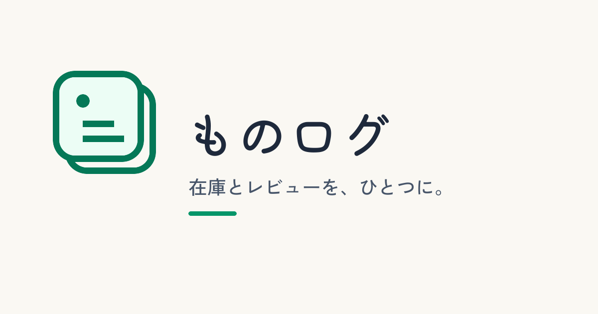
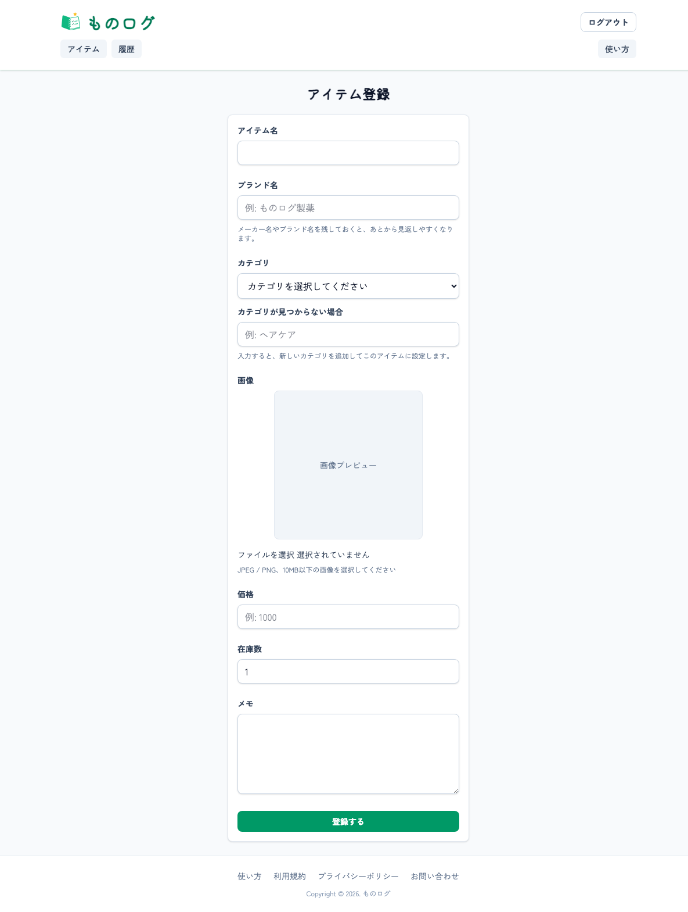
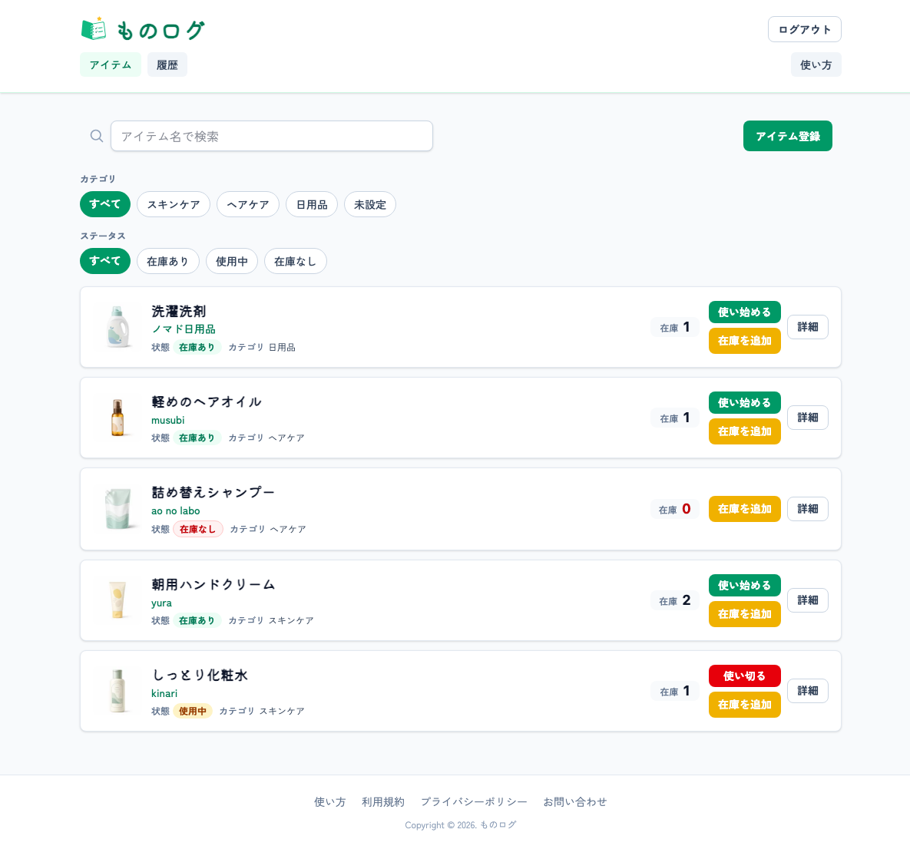
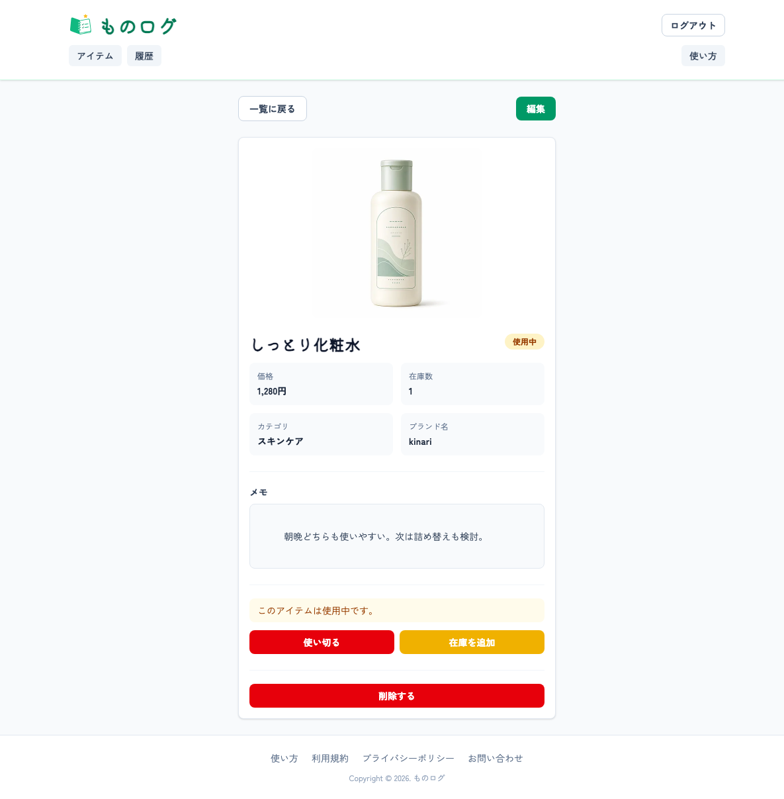
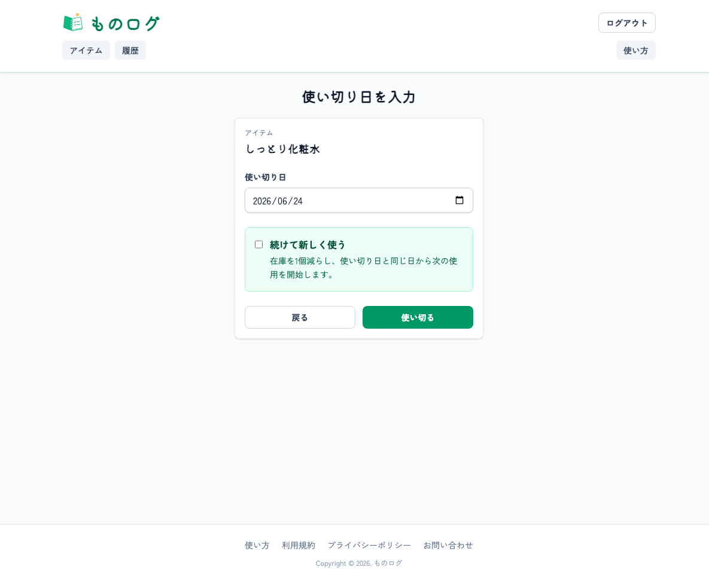
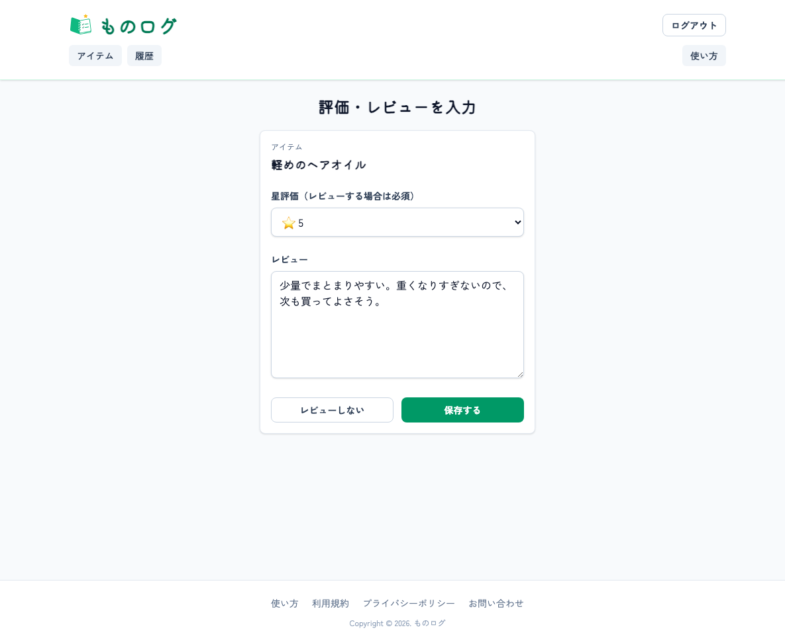
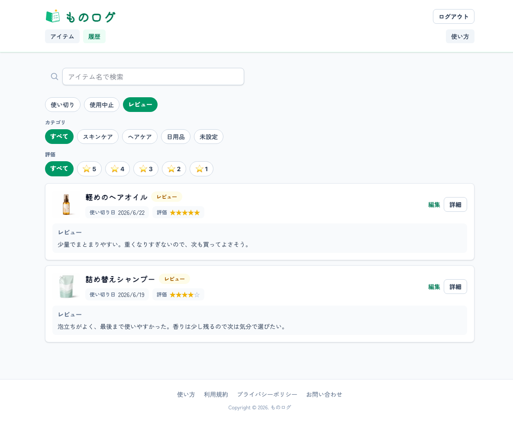

# ものログ

## サービス概要

ものログは、日用品や化粧品などの在庫とレビューを記録できる、個人向けのアイテム管理アプリです。

アイテム名・ブランド名・カテゴリ・在庫数・画像・メモを登録し、使い始め・使い切り・使用中止の履歴を残せます。使い切ったあとに評価やレビューを記録することで、過去の使用感を見返しながら次の買い物に活かせます。

在庫管理だけで終わらせず、「前に使ったときどうだったか」「また買いたいか」を自分用のログとして残していくことができます。

## アプリURL

https://monolog-note.com/

## このサービスへの思い・作りたい理由

シャンプーやトリートメント、歯ブラシ、化粧品など、日用品は種類が多く、気に入ったものほどまとめ買いしがちです。

一方で、在庫があると思っていたのになかったり、同じものを買いすぎたり、以前使った商品の感想を忘れてしまったりすることがありました。

特に、ヘアケア用品や化粧品は「値段」「香り」「使い心地」「コスパ」など、次に買うかどうかを決めるための判断材料が多いです。買った直後は覚えていても、時間が経つと細かい感想を忘れてしまい、また同じように迷ってしまうことがありました。

ものログでは、スマホから手軽に在庫を確認しながら、使った感想も自分の記録として残せるようにしたいと考えています。

## ユーザー層について

### メインターゲット

日用品や化粧品などを、自分なりに選んで使いたい人

### サブターゲット

家庭内の日用品を管理している人

ストック管理をしながら、使ったものの感想も残しておきたい人

## 背景

日用品は、購入頻度が高く、種類も多いため、頭の中だけで管理し続けるのが難しくなりがちです。

また、一般的な在庫管理では「いくつ残っているか」は確認できても、「前に使ってどうだったか」までは残しにくいことがあります。

ものログは、在庫数とレビューを同じ場所で管理することで、買いすぎや買い忘れを防ぎながら、自分に合うアイテムを見つけやすくすることを目指しています。

## サービス利用のイメージ

1. アイテム名、ブランド名、カテゴリ、在庫数、画像、メモを登録する
2. アイテム一覧で、手元にある在庫を確認する
3. 使い始めたら、使用開始日を記録する
4. 使い切ったら、使い切り日を記録する
5. 評価とレビューを残す
6. レビュー一覧から、過去の感想を検索・絞り込みして見返す

## 機能一覧

| 画面 | 内容 |
| --- | --- |
| トップ | サービス概要、ログイン/新規登録への導線 |
| 使い方 | アプリの基本的な使い方をスクリーンショット付きで表示 |
| ログイン | メールアドレスとパスワードでログイン |
| 新規登録 | アカウント作成 |
| アイテム一覧 | 登録済みアイテムの一覧表示、検索、カテゴリ絞り込み、状態絞り込み、お気に入り絞り込み |
| アイテム登録 | アイテム名、ブランド名、カテゴリ、価格、在庫数、画像、メモを登録 |
| アイテム詳細 | 在庫数、カテゴリ、ブランド名、使用状態、平均評価、使い切り予測を確認 |
| アイテム編集 | 登録内容の更新、画像削除 |
| 使用中一覧 | 現在使用中のアイテム、使用開始日、使用日数、在庫数を表示 |
| 使い切り履歴 | 使い切ったアイテムの履歴を表示 |
| 使用中止履歴 | 使用中止したアイテムと理由を表示 |
| レビュー一覧 | 評価・レビューを検索、カテゴリ絞り込み、評価絞り込みで表示 |
| お問い合わせ | Googleフォームへの導線 |
| 利用規約 | 静的ページ |
| プライバシーポリシー | 静的ページ |

## 主な機能の詳細

### アイテム登録・編集

アイテム名、ブランド名、カテゴリ、価格、在庫数、画像、メモを登録できます。カテゴリは既存カテゴリから選ぶだけでなく、アイテム登録・編集時に新しいカテゴリ名を入力して追加できます。

登録後はアイテム情報を編集でき、画像を変更したい場合は登録済み画像の削除にも対応しています。

### 在庫管理

アイテム一覧と詳細画面では、在庫あり・在庫なし・使用中の状態を確認できます。在庫数が減ったアイテムには、一覧や詳細画面から在庫を追加できます。

よく使うものや、また購入したいものはお気に入りとして管理でき、アイテム一覧でお気に入りだけに絞り込めます。

### 使用履歴

使い始め、使い切り、使用中止を履歴として記録できます。使い切りと使用中止を分けて残すことで、「最後まで使ったもの」と「合わずにやめたもの」をあとから振り返れます。

使用中一覧では、使用開始日、使用日数、在庫数を確認でき、そのまま使い切りや使用中止の記録に進めます。

### レビュー管理

使い切ったあとに、星評価とレビューを登録できます。レビュー一覧では、アイテム名、カテゴリ、評価、レビュー入力状況で絞り込みながら過去の感想を探せます。

アイテム詳細では平均評価と評価件数を表示し、同じ商品をまた買うか判断しやすくしています。

### 使い切り予測

過去の使い切り履歴から平均使用日数を算出し、使用中アイテムの使い切り予測日を表示します。

在庫数だけではなく「今使っているものがいつ頃なくなりそうか」を確認できるため、買い忘れを防ぐための判断材料になります。

## 主要画面の利用イメージ

### アイテム一覧

登録済みアイテムを一覧で確認できます。検索、カテゴリ、状態、お気に入りを組み合わせて絞り込めるため、在庫確認や買い物前の確認に使いやすい画面です。

### アイテム詳細

在庫数、カテゴリ、ブランド名、平均評価、評価件数、メモ、使い切り予測を確認できます。使用開始、使い切り、在庫追加など、アイテムごとの操作の入口にもなっています。

### 使用中一覧

現在使用中のアイテムをまとめて確認できます。使用開始日と使用日数を見ながら、使い切りや使用中止の記録に進めます。

### 使い切り履歴・使用中止履歴

使い切ったものと使用を中止したものを分けて確認できます。使い切ったアイテムは評価やレビューと結びつき、使用中止したアイテムは合わなかった理由を残せます。

### レビュー一覧

過去の評価やレビューを検索・絞り込みして見返せます。買い物前に「前に使ってどうだったか」を確認するための画面です。

## 画面イメージ

| アイテム登録 | アイテム一覧 |
| --- | --- |
|  |  |

| アイテム詳細 | 使い切り入力 |
| --- | --- |
|  |  |

| レビュー入力 | レビュー一覧 |
| --- | --- |
|  |  |

## 使用技術

| 項目 | 技術 |
| --- | --- |
| バックエンド | Ruby 3.2.2 / Ruby on Rails 7.1.6 |
| フロントエンド | Tailwind CSS / Hotwire（Turbo, Stimulus） |
| データベース | PostgreSQL |
| 認証 | Devise |
| 画像管理 | Active Storage / Cloudflare R2 / image_processing / libvips |
| ページネーション | Kaminari |
| i18n | rails-i18n / devise-i18n |
| テスト | Minitest |
| CI | GitHub Actions |

## 使用技術の選定理由

### Ruby on Rails

認証、CRUD、ルーティング、画像アップロードなど、Webアプリに必要な基本機能を効率よく実装できるため採用しました。

### Hotwire（Turbo / Stimulus）

Rails標準の仕組みを活かしながら、画像プレビューや操作導線などの小さな体験改善を行いやすいため採用しました。

### Tailwind CSS

スマートフォンでの見やすさや、カード・ボタン・フォームの余白を細かく調整しやすいため採用しました。

### Active Storage / image_processing / libvips

アイテム画像を登録し、一覧用と詳細用で適切なサイズに変換して表示するために採用しました。

### Minitest / GitHub Actions

モデル・コントローラの主要な挙動をテストし、GitHub Actionsで継続的に確認できるようにしています。

## 技術的に工夫した点

### 使用状態を履歴から判定する設計

アイテム本体の `items` と、使い始め・使い切り・使用中止を記録する `usage_logs` を分けています。

使用中かどうかは `items.status` のような状態カラムではなく、`usage_logs.finished_at` が `nil` の未完了レコードがあるかどうかで判定します。これにより、同じアイテムを何度も使った場合でも、使用履歴を時系列で残しながら現在の使用状態を扱えます。

### 使い切りと使用中止を区別した履歴管理

使い切りと使用中止は、どちらも使用終了の履歴として残しつつ、`finish_reason` で区別しています。

最後まで使ったものは評価・レビューの対象にし、途中でやめたものは使用中止理由を残せるようにすることで、次回購入時の判断材料を増やしています。

### 検索・絞り込みの組み合わせ

アイテム一覧では、検索、カテゴリ、使用状態、お気に入りを組み合わせて絞り込めます。レビュー一覧では、アイテム名、カテゴリ、評価、評価・レビューの入力状況で絞り込めます。

在庫確認とレビューの振り返りは利用シーンが異なるため、それぞれの画面で探しやすい条件を用意しています。

### 使い切り予測の表示

過去の使い切り履歴から平均使用日数を計算し、使用中アイテムの使い切り予測日を表示しています。

在庫数だけでは見えにくい「今使っているものがいつ頃なくなりそうか」を補足し、買い忘れ防止につなげるための機能です。

### 画像表示の最適化

Active Storageのvariantを使い、一覧用のサムネイル画像と詳細用のプレビュー画像でサイズを分けています。

画面に合わせた画像サイズを使うことで、表示の見やすさと読み込みやすさの両方を意識しています。スマートフォンでは、画像アップロード時に撮影とファイル選択の導線を分け、操作しやすいようにしています。

## 差別化ポイント

### 競合サービス分析

一般的な在庫管理アプリは、物の数や保管場所を管理することに強い一方で、使った感想や次回購入の判断材料まで一緒に残す設計は弱い傾向があります。

### 当サービスの差別化ポイント

- 在庫管理とレビュー記録を同じアプリ内で扱える
- ブランド名やカテゴリを含めて、自分の買い物ログとして残せる
- 使い切り後に評価とレビューを残せるため、次回購入の判断材料になる
- 使用中止も履歴として残せるため、合わなかった理由も忘れずに管理できる
- 日用品や化粧品など、繰り返し買うアイテムの振り返りに特化している

## 今後の実装予定

今後は、より継続的に使いやすいサービスにするため、以下のような機能追加・改善を検討しています。

### 一部実装済み

- 使用期間の平均値
- 使用中アイテムの使い切り予測

### 今後実装したいこと

- なくなりそうなアイテムの表示
- 購入リマインド通知
- カテゴリ管理画面
- レビュー未入力の使い切り履歴表示
- グループでの在庫共有
- お気に入りアイテムの公開やSNS的な共有
- レビューやアイテム一覧の表示改善

## ER図

